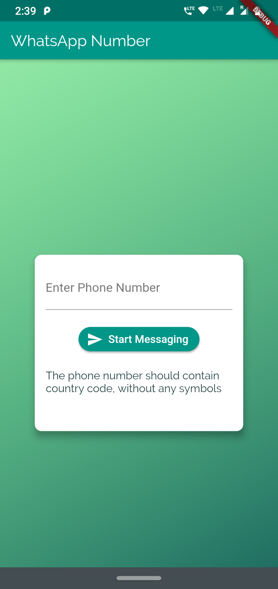

# whatsapp number

Whatsapp number will let you send whatsapp messages directly to numbers without saving into your phone contact , this will help when you want to contact someone temporarily and quickly and share information. saves lot of time from creating unnecessary contacts on your phone.

{:height="420px" width="260px"}
